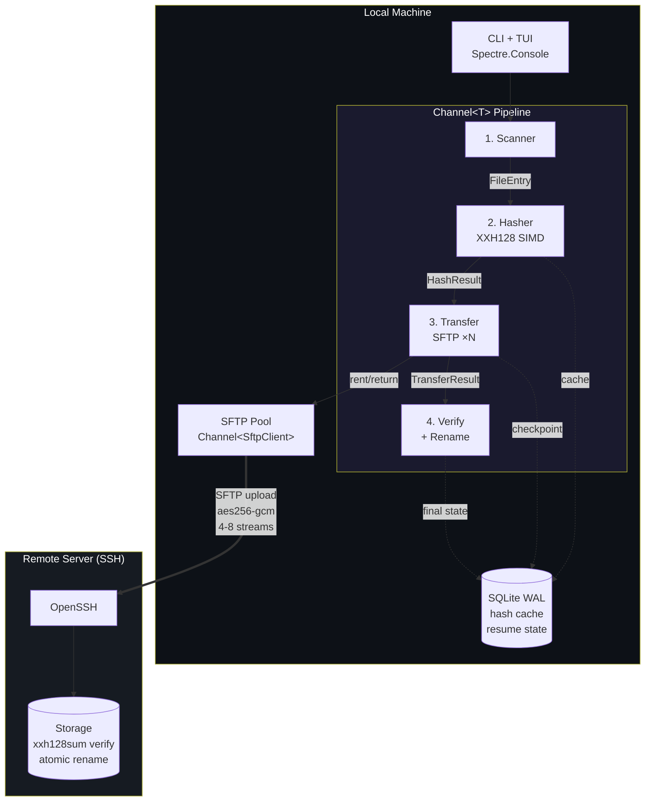
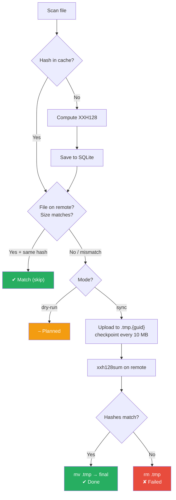

# xsync

[](https://dotnet.microsoft.com/)
[](LICENSE)
[]()

High-performance file synchronization over SFTP with XXH128 hash verification, parallel transfers, resume support, and an interactive terminal UI.

[Russian documentation (README.ru.md)](README.ru.md)

---

## Features

- **Parallel SFTP transfers** — 4-8 concurrent connections via SSH.NET managed pool
- **XXH128 hash verification** — SIMD-accelerated (AVX2/SSE2) hashing at ~12 GB/s
- **Atomic writes** — upload to `.tmp.{guid}`, verify hash, then rename
- **Resume** — checkpoint every 10 MB to SQLite; continue after crash or network failure
- **Interactive TUI** — file selection, live progress with per-file bars, keyboard controls
- **TOML config** — static configuration with CLI overrides
- **Structured logging** — JSON Lines per-run log files
- **Cross-platform** — single-file binaries for Windows, Linux, macOS

## Architecture



### Sync flow (per file)



## Installation

### Pre-built binaries

Download from [Releases](../../releases) and place next to `xsync.toml`:

| Platform | File |
|----------|------|
| Windows x64 | `xsync.exe` |
| Linux x64 | `xsync` |
| macOS ARM64 | `xsync` (Apple Silicon) |

### Build from source

Requires [.NET 10 SDK](https://dotnet.microsoft.com/download).

```bash
git clone https://github.com/dantte-lp/xsync.git
cd xsync
dotnet build -c Release
dotnet run -c Release -- --help
```

#### Publish single-file binary

```bash
# Windows
dotnet publish -c Release -r win-x64 --self-contained -p:PublishSingleFile=true -o dist/

# Linux
dotnet publish -c Release -r linux-x64 --self-contained -p:PublishSingleFile=true -o dist/

# macOS
dotnet publish -c Release -r osx-arm64 --self-contained -p:PublishSingleFile=true -o dist/
```

## Configuration

Create `xsync.toml` in the working directory (see [`xsync.example.toml`](xsync.example.toml)):

```toml
[source]
local_dir = "data"

[target]
host = "user@server"
port = 22
remote_dir = "/backup/data"
ssh_key = ".ssh/id_ed25519"

[transfer]
parallelism = 4
checkpoint_mb = 10

[storage]
db = "xsync.db"
logs_dir = "logs"

[filter]
exclude = [".crdownload", ".part", ".tmp"]
compressed_extensions = ["tar.gz", "qcow2", "ova", "iso", "exe", "zip"]
```

**Priority:** CLI arguments > `xsync.toml` > built-in defaults.

**Config search order:** current directory > executable directory.

## Usage

```bash
# Interactive mode — select files, then sync
xsync

# Dry run — hash all files, check remote, no transfers
xsync --dry-run

# Verify only — check that remote files match local hashes
xsync --verify-only

# Single file
xsync --file "backup.tar.gz"

# Parallel streams (1-8)
xsync --parallel 8

# Quiet / verbose
xsync -q          # errors + summary only
xsync -v          # debug output (SSH commands, timings)

# Override config
xsync --host user@10.0.0.1 --port 2222 --key ~/.ssh/id_rsa
xsync --local-dir /mnt/data --remote-dir /backup
```

### Keyboard controls (interactive mode)

| Key | Action |
|-----|--------|
| **Space** | Toggle file selection (pre-sync) |
| **Enter** | Confirm selection |
| **P** | Pause sync |
| **R** | Resume sync |
| **Q** | Graceful quit |
| **Ctrl+C** | Force quit |

### TUI layout

```
xsync | SYNC | 12/56 files | 45.2 GB/203.7 GB (22.2%) | 42.3 MB/s | ETA 1h05m
████████████████████░░░░░░░░░░░░░░░░░░░░░░░░░░░░░░░░░░░░░░░░░░░░░░░░░░░░░░░░░░
╭────┬──────────────────────────────────┬─────────┬──────────────────────┬───────┬────────╮
│  # │ File                             │    Size │ Progress             │ Speed │ Status │
├────┼──────────────────────────────────┼─────────┼──────────────────────┼───────┼────────┤
│  1 │ Foundation_Central_VM-2.1.qcow2  │  7.2 GB │ ████████████░░░░ 62% │ 45 MB │   ▲    │
│  2 │ nkp-bundle_v2.17.1_linux..tar.gz │ 23.2 GB │ waiting...           │       │   ·    │
│  3 │ 7.0.0.tar.gz                     │  607 MB │ a1b2c3d4e5f6         │       │   ✔    │
│  4 │ calm-vm-pc-7.5.1-calm..ova       │ 14.3 GB │ verifying hash...    │       │   …    │
╰────┴──────────────────────────────────┴─────────┴──────────────────────┴───────┴────────╯
 P  Pause   Q  Quit   Ctrl+C  Force quit
```

**Status icons:** `·` pending, `○` hashing, `▲` transferring, `…` verifying, `✔` done, `≡` match, `✘` failed

## Remote server requirements

- OpenSSH server with SFTP subsystem
- `xxh128sum` — for remote hash verification (`apt install xxhash` / `yum install xxhash`)
- SSH key authentication configured

### Recommended server tuning (high-throughput WAN)

```bash
# /etc/sysctl.d/99-xsync.conf
net.ipv4.tcp_congestion_control = bbr
net.core.default_qdisc = fq
net.core.rmem_max = 33554432
net.core.wmem_max = 33554432
net.ipv4.tcp_no_metrics_save = 1
```

## Tech stack

| Component | Technology |
|-----------|-----------|
| Runtime | .NET 10 / C# 14 |
| SSH/SFTP | [SSH.NET](https://github.com/sshnet/SSH.NET) 2025.1.0 |
| Hashing | System.IO.Hashing (XxHash128, SIMD) |
| Database | Microsoft.Data.Sqlite (WAL mode) |
| TUI | [Spectre.Console](https://spectreconsole.net/) |
| Resilience | [Polly](https://github.com/App-vNext/Polly) 8.6 (retry + circuit breaker) |
| Config | [Tomlyn](https://github.com/xoofx/Tomlyn) (TOML parser) |
| Pipeline | System.Threading.Channels |

## Code quality

All analyzers pass with zero warnings:

- Roslyn built-in (`TreatWarningsAsErrors`, `AnalysisLevel=latest-recommended`)
- [Meziantou.Analyzer](https://github.com/meziantou/Meziantou.Analyzer) 3.x
- [Roslynator](https://github.com/dotnet/roslynator)
- AsyncFixer
- [Semgrep](https://semgrep.dev/) (220 rules, SAST)
- [PVS-Studio](https://pvs-studio.com/) 7.42

## License

[MIT](LICENSE)
