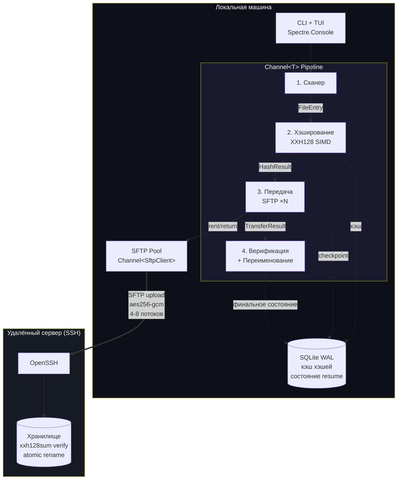
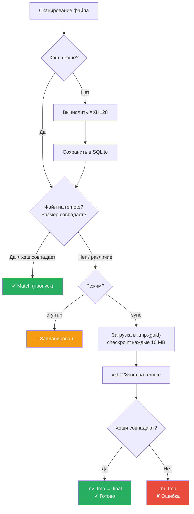

# xsync

[](https://dotnet.microsoft.com/)
[](LICENSE)
[]()

Высокопроизводительная синхронизация файлов по SFTP с верификацией XXH128, параллельными передачами, поддержкой resume и интерактивным TUI.

[English documentation (README.md)](README.md)

---

## Возможности

- **Параллельные SFTP-передачи** — 4-8 одновременных соединений через управляемый пул SSH.NET
- **Верификация XXH128** — SIMD-ускоренное хэширование (AVX2/SSE2) на ~12 GB/s
- **Атомарная запись** — загрузка в `.tmp.{guid}`, проверка хэша, затем переименование
- **Resume** — checkpoint каждые 10 MB в SQLite; продолжение после сбоя
- **Интерактивный TUI** — выбор файлов, live-прогресс с per-file барами, управление клавишами
- **TOML-конфигурация** — статическая настройка с CLI-переопределениями
- **Структурированные логи** — JSON Lines, отдельный файл на каждый запуск
- **Кроссплатформенность** — single-file бинарники для Windows, Linux, macOS

## Архитектура



### Поток синхронизации (на файл)



## Установка

### Готовые бинарники

Скачайте из [Releases](../../releases) и поместите рядом с `xsync.toml`:

| Платформа | Файл |
|-----------|------|
| Windows x64 | `xsync.exe` |
| Linux x64 | `xsync` |
| macOS ARM64 | `xsync` (Apple Silicon) |

### Сборка из исходников

Требуется [.NET 10 SDK](https://dotnet.microsoft.com/download).

```bash
git clone https://github.com/dantte-lp/xsync.git
cd xsync
dotnet build -c Release
dotnet run -c Release -- --help
```

#### Публикация single-file

```bash
# Windows
dotnet publish -c Release -r win-x64 --self-contained -p:PublishSingleFile=true -o dist/

# Linux
dotnet publish -c Release -r linux-x64 --self-contained -p:PublishSingleFile=true -o dist/

# macOS
dotnet publish -c Release -r osx-arm64 --self-contained -p:PublishSingleFile=true -o dist/
```

## Конфигурация

Создайте `xsync.toml` в рабочей директории (см. [`xsync.example.toml`](xsync.example.toml)):

```toml
[source]
local_dir = "data"

[target]
host = "user@server"
port = 22
remote_dir = "/backup/data"
ssh_key = ".ssh/id_ed25519"

[transfer]
parallelism = 4
checkpoint_mb = 10

[storage]
db = "xsync.db"
logs_dir = "logs"

[filter]
exclude = [".crdownload", ".part", ".tmp"]
compressed_extensions = ["tar.gz", "qcow2", "ova", "iso", "exe", "zip"]
```

**Приоритет:** CLI-аргументы > `xsync.toml` > значения по умолчанию.

**Порядок поиска конфига:** текущая директория > директория исполняемого файла.

## Использование

```bash
# Интерактивный режим — выбор файлов, затем синхронизация
xsync

# Dry run — хэширование, проверка remote, без передачи
xsync --dry-run

# Только верификация — проверка хэшей на remote
xsync --verify-only

# Один файл
xsync --file "backup.tar.gz"

# Параллельные потоки (1-8)
xsync --parallel 8

# Тихий / подробный режим
xsync -q          # только ошибки и итог
xsync -v          # отладочный вывод

# Переопределение конфига
xsync --host user@10.0.0.1 --port 2222 --key ~/.ssh/id_rsa
```

### Управление клавишами (интерактивный режим)

| Клавиша | Действие |
|---------|----------|
| **Space** | Вкл/выкл файл (при выборе) |
| **Enter** | Подтвердить выбор |
| **P** | Пауза синхронизации |
| **R** | Продолжить после паузы |
| **Q** | Корректное завершение |
| **Ctrl+C** | Принудительное завершение |

### Интерфейс TUI

```
xsync | SYNC | 12/56 files | 45.2 GB/203.7 GB (22.2%) | 42.3 MB/s | ETA 1h05m
████████████████████░░░░░░░░░░░░░░░░░░░░░░░░░░░░░░░░░░░░░░░░░░░░░░░░░░░░░░░░░░
╭────┬──────────────────────────────────┬─────────┬──────────────────────┬───────┬────────╮
│  # │ File                             │    Size │ Progress             │ Speed │ Status │
├────┼──────────────────────────────────┼─────────┼──────────────────────┼───────┼────────┤
│  1 │ Foundation_Central_VM-2.1.qcow2  │  7.2 GB │ ████████████░░░░ 62% │ 45 MB │   ▲    │
│  2 │ nkp-bundle_v2.17.1_linux..tar.gz │ 23.2 GB │ waiting...           │       │   ·    │
│  3 │ 7.0.0.tar.gz                     │  607 MB │ a1b2c3d4e5f6         │       │   ✔    │
╰────┴──────────────────────────────────┴─────────┴──────────────────────┴───────┴────────╯
 P  Пауза   Q  Выход   Ctrl+C  Принудительно
```

**Иконки статуса:** `·` ожидание, `○` хэширование, `▲` передача, `…` верификация, `✔` готово, `≡` совпадение, `✘` ошибка

## Требования к серверу

- OpenSSH с подсистемой SFTP
- `xxh128sum` — для верификации хэшей (`apt install xxhash` / `yum install xxhash`)
- Настроенная аутентификация по SSH-ключу

### Рекомендуемый тюнинг сервера (WAN)

```bash
# /etc/sysctl.d/99-xsync.conf
net.ipv4.tcp_congestion_control = bbr
net.core.default_qdisc = fq
net.core.rmem_max = 33554432
net.core.wmem_max = 33554432
net.ipv4.tcp_no_metrics_save = 1
```

## Стек технологий

| Компонент | Технология |
|-----------|-----------|
| Runtime | .NET 10 / C# 14 |
| SSH/SFTP | [SSH.NET](https://github.com/sshnet/SSH.NET) 2025.1.0 |
| Хэширование | System.IO.Hashing (XxHash128, SIMD) |
| База данных | Microsoft.Data.Sqlite (WAL mode) |
| TUI | [Spectre.Console](https://spectreconsole.net/) |
| Устойчивость | [Polly](https://github.com/App-vNext/Polly) 8.6 |
| Конфигурация | [Tomlyn](https://github.com/xoofx/Tomlyn) (TOML) |
| Pipeline | System.Threading.Channels |

## Качество кода

Все анализаторы проходят с нулём предупреждений:

- Roslyn (`TreatWarningsAsErrors`, `AnalysisLevel=latest-recommended`)
- [Meziantou.Analyzer](https://github.com/meziantou/Meziantou.Analyzer) 3.x
- [Roslynator](https://github.com/dotnet/roslynator)
- AsyncFixer
- [Semgrep](https://semgrep.dev/) (220 правил, SAST)
- [PVS-Studio](https://pvs-studio.com/) 7.42

## Лицензия

[MIT](LICENSE)
